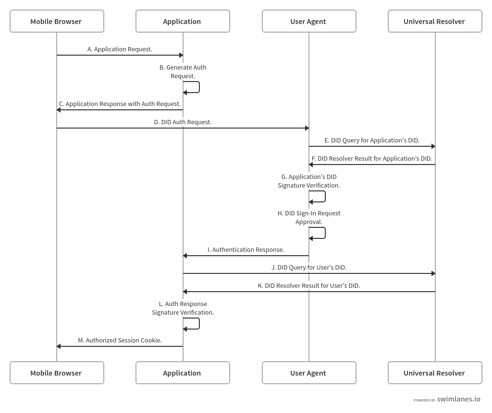

# Application Sign-In Protocol with OpenID Connect Self-Issued ID Tokens and DID Signatures

For an application to interact with DIDs, web developers will need javascript SDKs and/or native browser APIs that expose DID protocols in a convenient and easy to use manner. Common tasks a web developer might want to perform include:

- authenticating a user with their DID.
- requesting permissions from a user to access data in their identity hub.
- reading and/or writing data to a user's identity hub.

In this document, we'll focus on creating a way for consumers of an extension or mobile app user agent (UA) to use their DID to securely sign into an application. We'll propose protocols based on architectures #1, #2, and #6 from [this DID auth paper](https://github.com/WebOfTrustInfo/rebooting-the-web-of-trust-spring2018/blob/master/final-documents/did-auth.md) and a set of APIs for implementing these protocols. The sections below include:

* [Requirements](#Requirements): Briefly describes the goals of our protocols and APIs.
* [Protocol Flow](#Protocol-Flow): Illustrate the sign-in flow and the steps taken to verify a user through their UA from the client side of the webpage to the server side.

## Requirements

Our goal is to provide web developers with a neatly packaged javascript SDK that provides DID authentication capabilities. We've come up with the following requirements for our SDK:

- it should support all desktop and mobile browsers, within reason.
- it should support user agents that run as a browser extension or as a mobile app.
- it should support same-device and cross-device (desktop-mobile) authentication.
- it should provide APIs that enable a web developer to securely establish an authenticated session with their web server. This means the APIs will likely need a server-side component.

We've intentionally omitted the following goals from this document for the time being:

- enabling the use of a user agent running as a desktop app or process.
- integrating our APIs with front end frameworks like AngularJS or React.
- enabling use on cross platform.

## Protocol Flow


A. Application Request.  
The user goes to the application in their preferred browser on their preferred device (desktop or mobile).

B. Generate [Authentication Request](../lib/interfaces/AuthenticationRequest.ts).  
The OpenID Connect Self-Issued Authentication Request with DID signatures is formed and signed by the application.

C. Application Response with [Authentication Request](../lib/interfaces/AuthenticationRequest.ts).  
The webpage loads with a user action available (such as a button) that allows the user to sign into the application using their DID. The Authentication Request that the webpage will send to the User Agent is formed serverside and is included in this response back to the browser (See [OpenID Connect Claim Parameters](https://openid.net/specs/openid-connect-core-1_0.html#Claims) for more information about what types of claims are allowed).

*An [Authentication Request](../lib/interfaces/AuthenticationRequest.ts) Object.*  
This object will be put in a JWS signed by the Application.
```javascript
/**
 * OpenID Connect Self-Issued Authentication Request
 */
{
  /** DID of the issuer of the request.
   * This should match the signature. 
   */
  "iss": "did:doc:application",
  /** MUST be set as 'id_token' in order to match OIDC self-issued protocol */
  "response_type": "id_token",
  /** The redirect url as specified in the OIDC self-issued protocol */
  "client_id": "app://claims",
  /** MUST be set to "openid" */
  "scope": "openid",
  /** Opaque value used by issuer for state */
  "state": "af0ifjsldkj",
  /** Request Nonce */
  "nonce": "drnEJZTtfh",
  /** 
   * Claims that are requested.
   */
  "claims":{
            "id_token":{
                "age": {"essential": true}
            }
        }
}
```

D. DID [Authentication Request](../lib/interfaces/AuthenticationRequest.ts).  
The [Authentication Request](../lib/interfaces/AuthenticationRequest.ts) is sent to the User Agent in various ways:
   - In the desktop browser-browser extension flow, the Authentication Request is sent by a customized navigator.did.requestAuthentication function.
   - In the desktop browser-mobile device flow, the Authentication Request is sent by creating a QR code and scanning the QR code using the camera on a mobile device.
   - In the mobile browser-mobile device flow, the Authentication Request is sent by deep linking to the UA from the mobile browser.

E. DID Query for Application's DID.  
The User Agent queries for the application's DID document using a Universal Resolver.

F. DID Resolver Result for Application's DID.  
The Universal Resolver sends back the DID Document of the queried DID. This DID Document contains information about the DID including it's public key.

G. Application's DID Signature Verification.  
The User Agent uses the application's public key obtained by Step E to verify the signature on the JWT.

  > A note about Steps E-G: These steps make up a security measure to protect against malicious applications posing as real businesses. The Authentication Request will be signed using the application's DID in the form of a JWT, and the User Agent will verify this signature in order to confirm that this application is not pretending to be another.

H. DID Sign-In Request Approval.  
The user approves the sign-in request in their User Agent. If the user has multiple DIDs registered in their UA, they pick which one they want to use to sign in.

I. [Authentication Response](../lib/interfaces/AuthenticationResponse.ts).  
The User Agent sends the Authentication Response signed by the chosen DID to the server endpoint that was specified in the Authentication Request.

*An [Authentication Response](../lib/interfaces/AuthenticationResponse.ts) Object.*  
This object will be a put into a JWS signed by the user.
```
/** 
 * OpenID Connect Self-Issued ID Token Response. 
 */
{
  /** MUST be set to 'https://self-issued.me'. */
  "iss": 'https://self-issued.me';
  /** Base64UrlEncoded Thumbprint of the sub_jwk */
  "sub": [Base64UrlEncoded Thumbprint],
  /** The redirect url as specified in the OIDC self-issued protocol */
  "aud": "app://claims"
  /** Nonce of the challenge */
  "nonce": "drnEJZTtfh",
  /** Expiration as a UTC datetime */
  "exp": 1311281970,
  /** Issued at as a UTC datetime */
  "iat": 1311280970,
  /** the public key used to check the signature of the ID Token */       
  "sub_jwk": {
     "kty":"RSA",
     "n": "0vx7agoebGcQSuuPiLJXZptN9nndrQmbXEps2aiAFbWhM78LhWx
     4cbbfAAtVT86zwu1RK7aPFFxuhDR1L6tSoc_BJECPebWKRXjBZCiFV4n3oknjhMs
     tn64tZ_2W-5JsGY4Hc5n9yBXArwl93lqt7_RN5w6Cf0h4QyQ5v-65YGjQR0_FDW2
     QvzqY368QQMicAtaSqzs8KJZgnYb9c7d0zgdAZHzu6qMQvRL5hajrn1n91CbOpbI
     SD08qNLyrdkt-bFTWhAI4vMQFh6WeZu0fM4lFd2NcRwr3XPksINHaQ-G_xBniIqb
     w0Ls1jF44-csFCur-kEgU8awapJzKnqDKgw",
     "e":"AQAB"
    },
  /** DID used to sign the response */
  "did": "did:ion:EiDhJDBj8OHAyENIS5Bbyn0MYPSb4wUCps9Hi7sj_-V0BQ",
  /** Opaque value used by issuer for state,
   *  could contain values such as session ID. 
   */
  "state": af0ifjsldkj,
  /** Any claims that the issuer requested */
  "age": 35
}
```

J. DID Query for User DID.  
The server queries for the user's DID document using a Universal Resolver.

K. DID Resolver Result for User DID.  
The Universal Resolver sends back the DID Document of the queried DID.

L. Challenge Response Signature Verification.  
The server uses the user's public key obtained by Step K to verify the signature on the [Authentication Response](../lib/interfaces/AuthenticationResponse.ts).

M. Authorized Session Cookie.  
The server sends the browser an authorized session cookie that signs the user into the website.

## Example Code

We have included example code in the docs/examples folder for a simple sign-in flow. The [Server Example Code](./examples/server.ts) contains methods that would be included on the server side of a website that a user wants to use their DID to sign into. The [Client Example Code](./examples/client.ts) contains methods that would be in the User Agent the user has.

## Future work
- Include use of OpenID Connect registration object in request for conveying application details.
- Add another security measure to stop phishing attacks. An example of this attack would be if a malicious attacker sends an email to the victim with a QR code containing a Authentication Request from the attacker's browser and asks the victim to scan the QR code to sign into a specific website. The victim scans the QR code with their Wallet App and approves the sign-in request. The server will then send the authorized cookie to the attacker's browser that gives them access to the victim's account. We will eventually need a way to prevent a phishing attack of this nature. A couple of proposed solutions are:
     - presenting a code on the mobile device to match with one presented in the browser
- Add a fourth flow in order to sign into mobile apps and PWAs. In this flow, we will have to consider sign in to potentially occur when the device in offline and cannot connect to the application's server.
